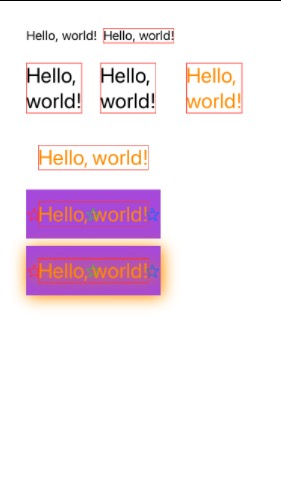

# just_learn_SwiftUI

>SwiftUI学习记录

[官方教程 SwiftUI Tutorials](https://developer.apple.com/tutorials/swiftui/creating-and-combining-views)

>[Text/VStack/HStack](./01_first_demo_swiftui/01_first_demo_swiftui/ContentView.swift)
